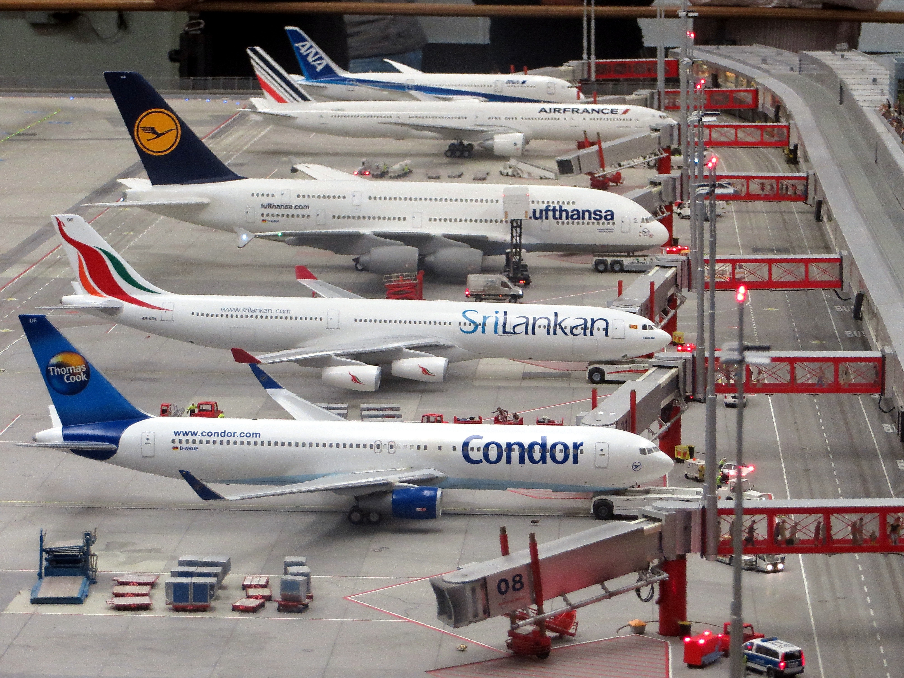

# Airlines-flight-cancellation

# Dataset Overview
This is a power BI project on **Airlines flight delay and cancellation**. The dataset contains commercial airline flight data in 2015, compiled for U.S. DOT Air Travel customer report that was provided by Quantum analytics.
The dataset consists of 4 workbooks which are airport which contains the airports names, airlines(contains the airlines name),cancellation(contains reasons for cancellation) and flight.The flight workbook contains 5,000,000+ rows and 36 columns. Some of these columns include Airlines, flight number, tail number, origin airport, destination airport, scheduled departure, departure time, departure delay, scheduled time, air time, elapsed time, diverted, cancelled e .t. c

The goal of this project is to analyze 
- the flight trends by months and day of the week. 
- the percentage of flights that experienced departure delay in 2015.
- variation of delayed flight per month
- 
- total number of flights cancelled in 2015
- % of cancellation due to weather and % due to airline/carrier
- the most and least reliable airline in terms of on-time departure

# Skills and Concept Demonstrated 
The following Power BI features were incorporated
- replace values
- conditional formatting columns(to input the airport name)
- DAX
- filters

# Summary of Findings

After the dataset was analysed throughly, the following insights were generated
 - July has the highest flight of 0.52M and Febuary has the least flight of 0.43M for the year
 - for the days of the week, thursday has the highest flight of 873k and sat

